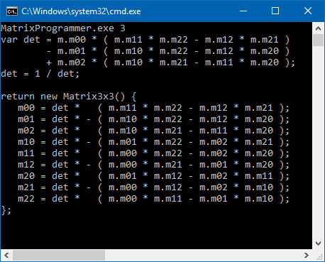

# N-Matrix-Programmer
A program to create a program that calculates inverse and determinant of N by N matrix.

## Background

This program is created for programmers who want to write the program which will do inverse and determinant of N by N matrix.

For those who need it, it creates the code for you automatically in an instant, therefore saves you hours (even days) of time.

The output syntaxes and N-order can be changed via code or command-line arguments.

## Output samples
C# code: [1x1](Info/Matrix_1x1_cs.txt) [2x2](Info/Matrix_2x2_cs.txt) [3x3](Info/Matrix_3x3_cs.txt) [4x4](Info/Matrix_4x4_cs.txt) [5x5](Info/Matrix_5x5_cs.txt) [6x6](Info/Matrix_6x6_cs.txt) [7x7](Info/Matrix_7x7_cs.txt) [8x8](Info/Matrix_8x8_cs.txt) [9x9](Info/Matrix_9x9_cs.txt) [10x10](Info/Matrix_10x10_cs.txt).
C++ code: [1x1](Info/Matrix_1x1_cpp.txt) [2x2](Info/Matrix_2x2_cpp.txt) [3x3](Info/Matrix_3x3_cpp.txt) [4x4](Info/Matrix_4x4_cpp.txt) [5x5](Info/Matrix_5x5_cpp.txt) [6x6](Info/Matrix_6x6_cpp.txt) [7x7](Info/Matrix_7x7_cpp.txt) [8x8](Info/Matrix_8x8_cpp.txt) [9x9](Info/Matrix_9x9_cpp.txt) [10x10](Info/Matrix_10x10_cpp.txt).

## Warning
The computation time (including output code size and processing memory) is [O(N!N^3)](http://www.cg.info.hiroshima-cu.ac.jp/~miyazaki/knowledge/teche23.html) as its complexity always increased over N.

However, for N>=4 The output steps is cached in local variables progressively for every (N-1), therefore the computation time is only O(N!), making the most efficient code that you'll ever see.

## License
The program and its generated code are both licensed as [MIT](LICENSE)